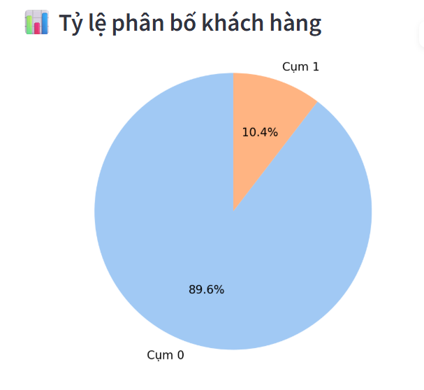
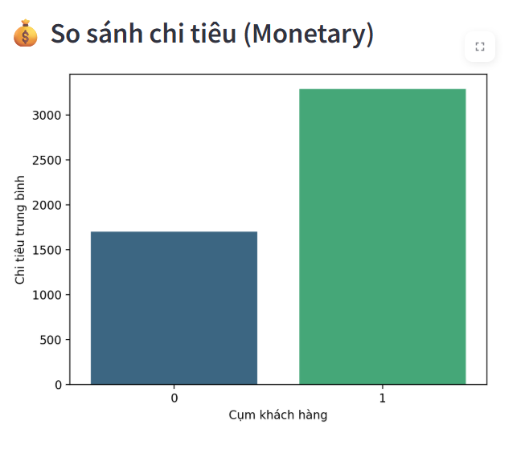
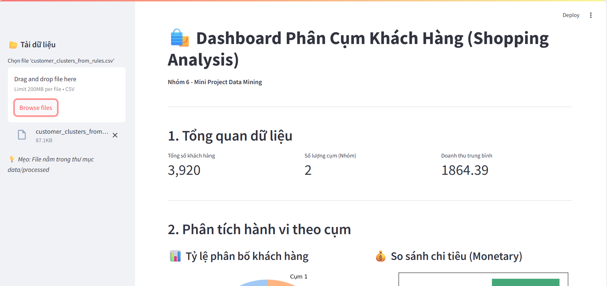

## 👥 Thông tin Nhóm

- **Nhóm:** 6
- **Thành viên:**
  - Ngô Hoàng Huy
  - Mai Văn Tiến
  - Chu Ngọc Hân
  - Nguyễn Trí Dũng

# PHÂN CỤM KHÁCH HÀNG DỰA TRÊN LUẬT KẾT HỢP (FP-GROWTH & K-MEANS)

## 1. Tổng quan dự án
Dự án này sử dụng kỹ thuật khai phá dữ liệu (Data Mining) để phân khúc khách hàng của trang thương mại điện tử Online Retail. Thay vì chỉ sử dụng các chỉ số RFM truyền thống, chúng tôi kết hợp **Luật kết hợp (Association Rules)** bằng thuật toán **FP-Growth** để hiểu sâu hơn về thói quen mua sắm, từ đó phân cụm khách hàng chính xác hơn.

**Mục tiêu:** Xây dựng chân dung khách hàng (Customer Persona) để đề xuất chiến lược Marketing cá nhân hóa cho từng nhóm.

---

## 2. Kết quả Phân cụm & Trực quan hóa

### 2.1. Phân bố các nhóm khách hàng

> **Nhận xét:**
> - Hệ thống phân loại khách hàng thành **2 nhóm** rõ rệt.
> - **Cluster 0 (Nhóm phổ thông):** Chiếm đa số áp đảo (khoảng 90% lượng khách).
> - **Cluster 1 (Nhóm thiểu số):** Chỉ chiếm khoảng 10% nhưng có hành vi mua sắm rất khác biệt.

### 2.2. Phân tích giá trị tài chính (RFM Analysis)
Chúng tôi sử dụng mô hình RFM (Recency - Frequency - Monetary) để đánh giá chất lượng từng cụm:

| Cụm (Cluster) | Số lượng | Recency (Ngày chưa mua) | Frequency (Số lần mua) | Monetary (Chi tiêu) |
| :--- | :--- | :--- | :--- | :--- |
| **0** | 3,512 | **98.81** (Cao) | 3.80 (Thấp) | 1,698.89 (Thấp) |
| **1** | 408 | **35.42** (Thấp) | **8.08** (Cao) | **3,288.92** (Cao) |

> **Phân tích:**
> - **Về chi tiêu (Monetary):** Cluster 1 là nhóm "đại gia" với mức chi tiêu trung bình gấp đôi Cluster 0 (3288 vs 1698).
> - **Về độ trung thành (Recency):** Cluster 0 có nguy cơ rời bỏ cao (hơn 3 tháng chưa quay lại), trong khi Cluster 1 mới mua sắm gần đây (khoảng 1 tháng).

---

## 3. Chân dung khách hàng & Đề xuất chiến lược

Dựa trên kết quả phân tích số liệu, chúng tôi định danh 2 nhóm khách hàng như sau:

| Nhóm (Cluster) | Tên gọi (Persona) | Đặc điểm chính | Chiến lược đề xuất |
| :--- | :--- | :--- | :--- |
| **Cluster 1** | **VIP "Sành điệu" & Trung thành** | - Mua sắm thường xuyên (8 lần/kỳ). - Chi tiêu mạnh tay. - Rất thích các sản phẩm theo Combo luật kết hợp. | **Chiến lược Giữ chân (Retention):** - Chăm sóc đặc biệt (VVIP Care). - Bán chéo (Cross-sell) các sản phẩm dựa trên Top Rules. - Tặng quà tri ân thay vì giảm giá sâu. |
| **Cluster 0** | **Khách hàng Vãng lai / Ngủ đông** | - Lâu không quay lại mua hàng. - Giá trị đơn hàng thấp. - Chiếm số lượng rất đông. | **Chiến lược Kích cầu (Re-activation):** - Gửi email "We miss you" kèm Voucher có thời hạn. - Khuyến mãi Free Ship để thúc đẩy quay lại. - Gợi ý các sản phẩm phổ biến nhất (Best Sellers). |

---

## 4. Demo Dashboard Báo cáo
Nhóm đã xây dựng giao diện Dashboard tương tác bằng **Streamlit** để hỗ trợ doanh nghiệp tra cứu nhanh:

---

## 5. Kết luận
Dự án đã thực hiện thành công việc ứng dụng thuật toán **FP-Growth** và **K-Means** để giải quyết bài toán doanh nghiệp:
1.  **Hiệu năng:** FP-Growth chứng minh tốc độ xử lý vượt trội so với Apriori trên tập dữ liệu lớn.
2.  **Giá trị thực tiễn:** Giúp doanh nghiệp nhận diện chính xác nhóm khách hàng VIP (Cluster 1) để tối ưu lợi nhuận và nhóm khách hàng rủi ro (Cluster 0) để có biện pháp can thiệp kịp thời.
